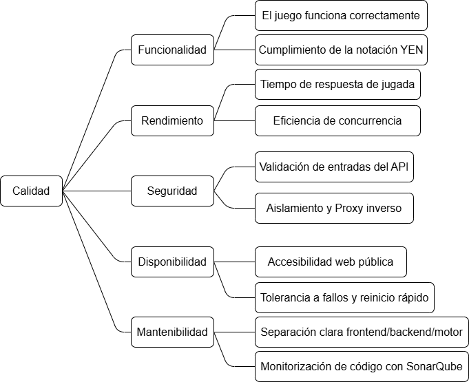

ifndef::imagesdir[:imagesdir: ../images]

[[section-quality-scenarios]]
== Requisitos de calidad

=== Árbol de calidad

["Árbol de calidad"]

=== Escenarios de calidad

[options="header",cols="1,2"]
|===
| Atributo de Calidad | Escenario / Descripción

| **Funcionalidad (Juego y Notación YEN)**
| El sistema debe permitir jugar partidas de forma íntegra garantizando el **cumplimiento estricto de la notación YEN**. Cuando un usuario realiza una jugada desde la interfaz web, el motor (Rust) debe procesarla, validarla contra las reglas del juego y devolver el nuevo estado serializado en notación YEN sin errores lógicos.

| **Rendimiento (Tiempo de respuesta de jugada)**
| El sistema debe garantizar un **tiempo de respuesta de jugada** óptimo. A pesar de estar dividido en microservicios y orquestado a través de un proxy inverso (`nginx`), la comunicación entre el frontend, el API de usuarios y el motor del juego debe procesar y devolver la jugada al usuario en menos de 1 segundo en condiciones normales de red.

| **Seguridad (Validación de entradas y Entorno)**
| El API debe realizar una validación estricta de las entradas para evitar inyecciones o estados de juego corruptos. Además, la seguridad a nivel de despliegue se garantiza mediante el aislamiento de la base de datos, el uso de proxy inverso (`nginx.conf`) para enrutar el tráfico de forma segura y la gestión de credenciales sensibles mediante variables de entorno (`.env`).

| **Disponibilidad (Accesibilidad web pública)**
| El sistema debe garantizar la **accesibilidad web pública** y alta disponibilidad mediante su contenedorización. El uso de `docker-compose` y `docker-entrypoint.sh` asegura que, en caso de caída de un servicio (frontend, backend o base de datos), el sistema pueda reiniciarse y recuperar el estado operativo con un tiempo de inactividad mínimo.

| **Mantenibilidad (Separación de componentes)**
| El código y la infraestructura deben mantener una **separación clara entre frontend (`webapp`), backend (`users`) y motor (`gamey`)**. Esta arquitectura orientada a servicios (orquestada vía Docker) permite actualizar el frontend o añadir nuevas endpoints en el backend de Node/TS sin necesidad de recompilar el motor de reglas estricto escrito en Rust.
|===