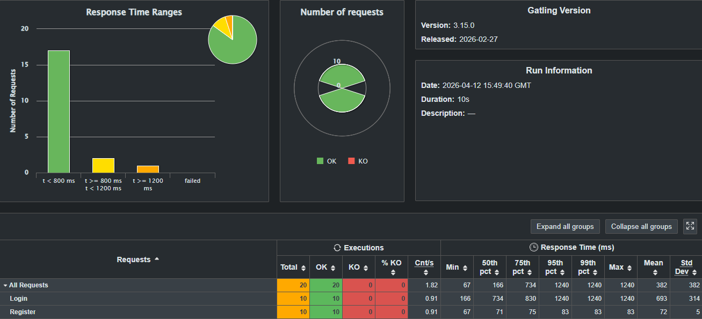
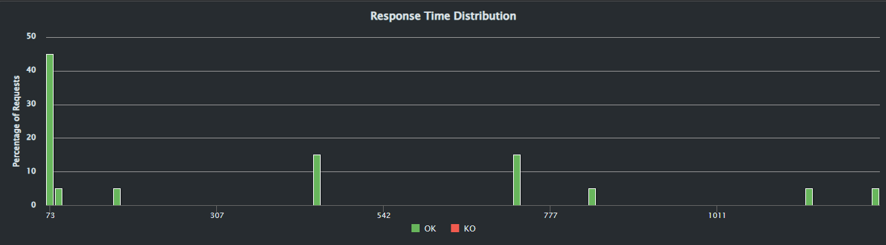
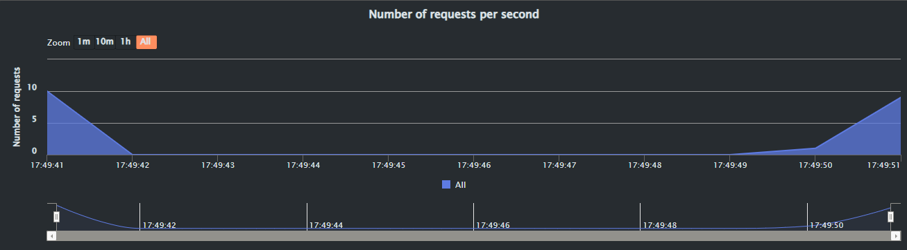
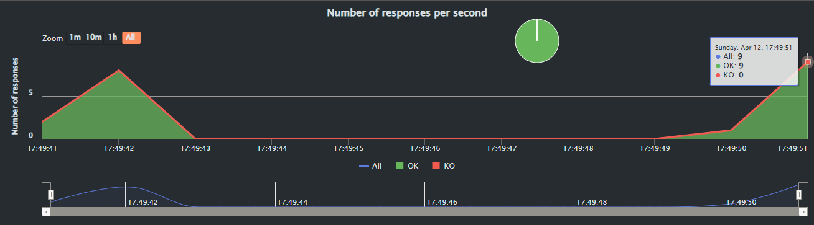
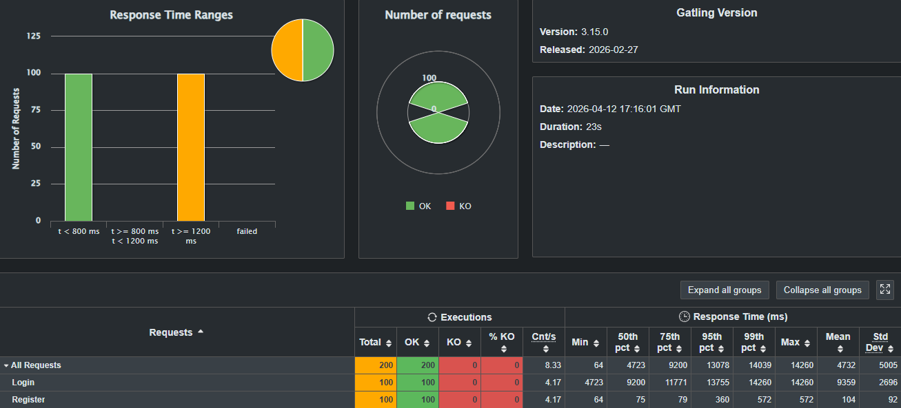

ifndef::imagesdir[:imagesdir: ../images]
= Testing Documentation - YOVI
:toc:
:toc-placement: left
:toclevels: 3
:sectnums:
:sectanchors:

== Introducción

Este documento describe la estrategia de testing de YOVI y los mecanismos utilizados para validar calidad, estabilidad y rendimiento del sistema.

La aplicación está compuesta por:

* Motor de juego en Rust (`gamey`)
* Servicio de usuarios en Node.js (`users`)
* Aplicación web en React (`webapp`)
* Pruebas de carga con Gatling

=== Objetivos

* Verificar el correcto funcionamiento del sistema
* Detectar errores de forma temprana
* Validar integración entre componentes
* Medir rendimiento bajo carga
* Automatizar pruebas mediante CI/CD

== Estructura del Testing

=== Directorios principales

[source]
----
yovi_es3a/
├── gamey/tests/
├── users/__tests__/
├── webapp/__tests__/
├── testCarga/
└── docs/TESTING.adoc
----

=== Herramientas utilizadas

|===
| Herramienta | Componente | Uso

| Cargo Test
| gamey
| Tests unitarios Rust

| Vitest
| users, webapp
| Tests unitarios e integración

| Supertest
| users
| Testing de APIs REST

| Playwright
| webapp
| Tests E2E

| Gatling
| testCarga
| Tests de carga

| SonarQube
| Todos
| Calidad y cobertura

| GitHub Actions
| Todos
| Automatización CI/CD
|===

== Testing del Motor de Juego (gamey)

=== Visión General

El motor de juego está desarrollado en Rust y utiliza `cargo test`.

Se validan reglas del juego, movimientos, detección de victoria, persistencia y servidor de bots.

=== Categorías de Tests

|===
| Categoría | Descripción

| Inicialización
| Creación correcta del tablero y estado inicial

| Flujo de juego
| Turnos, movimientos válidos y ocupación

| Victoria
| Detección de conexión de tres lados

| Errores
| Jugadas inválidas y turnos incorrectos

| Persistencia
| Guardado y carga en formato YEN

| Coordenadas
| Conversión índice ↔ coordenadas

| Bot Server
| Endpoints HTTP/WebSocket
|===

=== Ejecución

[source,bash]
----
cd gamey
cargo test
cargo llvm-cov
----

== Testing del Servicio de Usuarios (users)

=== Visión General

El servicio de usuarios en Node.js utiliza Vitest y Supertest para validar lógica interna y endpoints REST.

=== Categorías de Tests

|===
| Categoría | Descripción

| Registro
| Alta de usuarios y validación de datos

| Login
| Credenciales correctas e incorrectas

| CRUD
| Operaciones básicas sobre usuarios

| Seguridad
| Hash de contraseñas y tokens

| Validación
| Emails y contraseñas válidas

| Manejo de errores
| Respuestas ante entradas inválidas
|===

=== Ejecución

[source,bash]
----
cd users
npm test
npm run test:coverage
----

== Testing del Frontend (webapp)

=== Visión General

El frontend desarrollado en React + TypeScript utiliza Vitest para tests unitarios y Playwright para pruebas End-to-End.

=== Categorías de Tests

|===
| Categoría | Descripción

| Componentes
| Renderizado y props

| Formularios
| Inputs y validaciones

| Navegación
| Cambio entre páginas

| Integración
| Comunicación con backend

| Juego
| Renderizado del tablero e interacción

| E2E
| Login y flujo completo de partida
|===

=== Ejecución

[source,bash]
----
cd webapp
npm test
npm run test:coverage
npx playwright test
----

== Testing de Carga (Gatling)

=== Visión General

Gatling se utiliza para simular múltiples usuarios concurrentes y medir rendimiento del sistema.

=== Proceso de ejecución

. Inicio de Gatling desde el entorno de desarrollo
. Uso del modo Recorder para capturar tráfico real
. Simulación de acciones principales:
* Registro de usuario
* Inicio de sesión
. Generación automática del script
. Ajuste manual del escenario:
* Incremento de usuarios
* Repeticiones
* Parámetros de carga
. Ejecución de la simulación

=== Escenarios evaluados

|===
| Escenario | Descripción

| Login concurrente
| Varias autenticaciones simultáneas

| Registro concurrente
| Creación simultánea de usuarios

| Carga progresiva
| Incremento gradual de usuarios

| Estrés
| Alta concurrencia sostenida
|===

=== Métricas analizadas

* Tiempo de respuesta medio
* Percentiles p95 / p99
* Throughput
* Solicitudes exitosas/fallidas
* Estabilidad del sistema

=== Resultados: Escenario Base (10 usuarios)

==== Métricas generales

* Tasa de éxito: 100%
* Errores KO: 0
* Duración aproximada: 10 segundos
* Pico máximo: 10 peticiones/segundo
* Respuestas rápidas concentradas en ~73 ms
* Algunos picos aislados entre 542 ms y 1000+ ms

==== Rendimiento por endpoint

|===
| Endpoint | Peticiones | Mínimo | p50 | p95 | Máximo | Media

| Login
| 10
| 166 ms
| 734 ms
| 1240 ms
| 1240 ms
| 693 ms

| Register
| 10
| 67 ms
| 71 ms
| 83 ms
| 83 ms
| 72 ms
|===

["Grafica de resultados Gatling 10 usuarios"]

==== Análisis

El sistema respondió correctamente sin errores. El endpoint `register` mostró excelente rendimiento y `login` fue claramente más costoso.

["Distribución de tiempo de respuesta"]
["Numero de peticiones por segundo"]
["Numero de respuesta por segundo"]

=== Resultados: Escenario Alta Carga (100 usuarios)

==== Métricas generales

* Total de peticiones: 200
* 100 login + 100 register
* Tasa de éxito: 100%
* Errores KO: 0
* Tiempo medio global: 4723 ms

==== Distribución observada

* ~100 peticiones por debajo de 800 ms
* ~100 peticiones por encima de 1200 ms

==== Rendimiento por endpoint

|===
| Endpoint | Peticiones | Mínimo | p50 | p95 | Máximo | Media

| Login
| 100
| 4700 ms
| 8300 ms
| 14200 ms
| 14200 ms
| 8300 ms

| Register
| 100
| 84 ms
| 78 ms
| 870 ms
| 870 ms
| 104 ms
|===

["Grafica de resultados Gatling 100 usuarios"]

==== Análisis

Existe una diferencia crítica entre endpoints:

* `register` mantiene tiempos excelentes incluso bajo carga.
* `login` se degrada severamente al aumentar concurrencia.

image::../images/statsGatling101_1.png[]["Distribución de tiempo de respuesta"]
image::../images/statsGatling101_2.png[]["Numero de peticiones por segundo y respuestas por segundo"]

=== Ejecución

[source,bash]
----
cd testCarga
./mvnw gatling:test
----

== Integración Continua (CI/CD)

=== Automatización

GitHub Actions ejecuta pruebas automáticamente en cada push y pull request.

=== Flujo

. Instalación de dependencias
. Ejecución de tests Rust
. Ejecución de tests Node.js
. Cobertura de código
. Tests de carga
. Análisis con SonarQube

=== Quality Gate

|===
| Métrica | Objetivo

| Cobertura
| ≥ 80%

| Vulnerabilidades
| 0

| Duplicación
| ≤ 3%

| Code Smells
| Bajo nivel
|===

== Glosario

[%header,cols="25%,75%"]
|===
| Término | Definición

| Unit Test
| Prueba de una unidad individual

| Integration Test
| Prueba entre componentes

| E2E Test
| Flujo completo de usuario

| Coverage
| Porcentaje cubierto por tests

| Gatling
| Herramienta de carga

| YEN
| Formato de persistencia del juego

| CI/CD
| Integración y despliegue continuo
|===